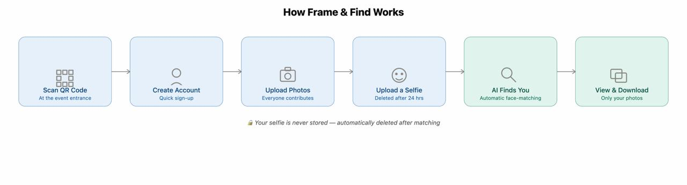
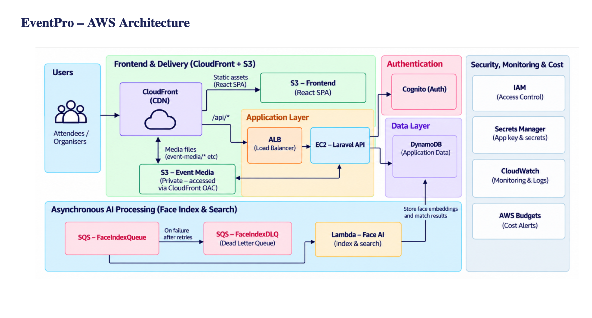

# EventPro (Frame & Find) — AI-based event photo sharing

An event photo-sharing platform where attendees upload photos, then find the
ones they're in using selfie-based face matching. Built with Laravel (API),
React (SPA), and a serverless face-recognition pipeline on AWS.

## How Frame & Find works



An event organiser creates an event and prints/shares its QR code. From
there, the flow is:

1. **Scan QR code** — Attendees scan the code at the event entrance. It opens
   a per-event upload page (`/e/:slug/upload`).
2. **Create account** — A quick sign-up (or login) via Cognito, so uploaded
   photos and matches can be tied to the attendee.
3. **Upload photos** — Anyone at the event can contribute photos taken during
   it; they're stored in the event's private S3 media bucket.
4. **Upload a selfie** — The attendee uploads one selfie of themselves. It's
   used only to compute a face embedding and is **deleted after 24 hours** —
   the raw image is never kept.
5. **AI finds you** — An asynchronous face-recognition pipeline (SQS →
   Lambda, dlib-based) indexes every uploaded photo and matches faces against
   the attendee's embedding automatically, with no manual tagging.
6. **View & download** — The attendee sees and downloads only the photos
   they were matched in.

Privacy is baked into the pipeline: selfies are transient, matching is
opt-in, and each attendee only ever gets access to their own matched photos.

## Architecture at a glance



```
User (browser)
    │
    ▼
CloudFront (CDN)
    ├──▶ S3 — React SPA (static frontend)
    └──▶ ALB ──▶ EC2 — Laravel API
                     ├──▶ DynamoDB   (events, photos, face data)
                     ├──▶ S3         (photo storage)
                     ├──▶ Cognito    (auth, JWT)
                     ├──▶ Secrets Manager (app key, Cognito secret)
                     └──▶ SQS ──▶ Lambda (face index/search, dlib) ──▶ DynamoDB
```

The diagram breaks the system into five zones:

- **Frontend & delivery** — CloudFront serves the React SPA from an S3
  bucket and proxies `/api/*` requests to the backend; a second, private S3
  bucket holds event media, accessible only via CloudFront's Origin Access
  Control (OAC).
- **Application layer** — An Application Load Balancer routes API traffic to
  the EC2 instance running the Laravel API.
- **Authentication** — Amazon Cognito issues and validates JWTs; no
  passwords are stored by the app itself.
- **Data layer** — DynamoDB holds all application data (events, photos, face
  embeddings, match results).
- **Asynchronous AI processing** — New/updated media triggers a message on
  the `FaceIndexQueue` (SQS); a Lambda function indexes or searches faces and
  writes embeddings/results back to DynamoDB. Failed jobs move to a dead
  letter queue (`FaceIndexDLQ`) after retries so they don't get lost.
- **Security, monitoring & cost** — IAM scopes access per-resource, Secrets
  Manager holds the app key and Cognito secret, CloudWatch collects logs and
  alarms, and AWS Budgets sends spend alerts.

Full write-up: see `docs/ARCHITECTURE.md` (or ask in the project chat history —
every design decision is explained there, including *why* each service was
chosen over the alternatives).

## Prerequisites

- Docker + Docker Compose (local development)
- AWS CLI v2, configured (`aws configure`) with credentials for an account/role
  that can create the resources below
- Node.js 18+ and npm (frontend build)
- An SSH client
- `jq` (optional, used by some AWS CLI query examples)

## Local development

The full stack (DynamoDB Local + Laravel API + React SPA) runs in Docker —
no AWS account needed for local dev.

```bash
git clone <this-repo-url>
cd eventpro

docker compose up -d --build      # builds and starts everything
docker compose run --rm seed      # loads demo data (admin@eventpro.com / password)
```

Open:
- Frontend: http://localhost:5173
- API: http://localhost:8000
- API health check: http://localhost:8000/up

Stop everything:
```bash
docker compose down
```

DynamoDB Local runs in-memory — data resets every time the stack stops.

## AWS deployment (production)

Everything is defined as code in `infra/cloundformatter-template.yaml`
(CloudFormation) and orchestrated by `deploy.sh`. **Region: `us-east-1`.**

### One-time setup

1. Make sure your AWS CLI is authenticated against the target account:
   ```bash
   aws sts get-caller-identity
   ```
2. Set the email that should receive budget alerts:
   ```bash
   export BUDGET_EMAIL="you@example.com"
   ```
3. Make `deploy.sh` executable:
   ```bash
   chmod +x deploy.sh
   ```

### Full deploy — one command

```bash
./deploy.sh up
```

This runs, in order:

| Step | What it does |
|---|---|
| `infra-only` | Deploys the CloudFormation stack: DynamoDB, S3 (media + SPA), Cognito, Secrets Manager, IAM role, EC2, ALB, CloudFront, CloudWatch alarms, AWS Budget. `EnableFaceSearch` starts `false` because the face-recognition container image doesn't exist yet. |
| `app-fix` | SSHes into the new EC2 instance, writes a correct `.env` (using the real Cognito pool/client IDs, S3 bucket name, and CloudFront domain the stack just created), builds and starts the Laravel container, seeds demo data, and creates the storage symlink. |
| `push-image` | Builds the `framefind-faces` Docker image (dlib-based face-recognition code) and pushes it to the ECR repository the stack created. |
| `enable-faces` | Updates the stack with `EnableFaceSearch=true`, which adds the SQS queue and the two Lambda functions (`*-index`, `*-search`). Then SSHes back into EC2 to fill in the now-known Lambda name and queue URL and restarts the API container. |
| `frontend` | Builds the React app and syncs it to the SPA S3 bucket, then invalidates the CloudFront cache. |

At the end it prints the CloudFront URL — that's the live site.

### Running steps individually

Each step above is also its own subcommand, useful when re-running just one
part (e.g. after a code change):

```bash
./deploy.sh infra-only     # (re)create just the CloudFormation stack
./deploy.sh app-fix        # re-push .env + rebuild + reseed on EC2
./deploy.sh push-image     # rebuild and re-push the face-recognition image
./deploy.sh enable-faces   # turn on / refresh the face-search pipeline
./deploy.sh frontend       # rebuild and redeploy just the React app
./deploy.sh outputs        # print all stack outputs (URLs, IDs)
./deploy.sh key            # fetch the EC2 SSH private key to ~/.ssh/
```

### Tearing down

```bash
./deploy.sh down
```

Empties both S3 buckets (required before CloudFormation can delete them) and
deletes the whole stack. DynamoDB, S3, Cognito, IAM, Lambda, SQS, ALB, EC2,
CloudFront, and the CloudWatch alarms are all removed. The ECR repository and
its stored image are **not** deleted automatically (ECR is not part of the
stack's lifecycle) — remove it separately at the end of the project:

```bash
aws ecr batch-delete-image --repository-name framefind-faces --region us-east-1 \
  --image-ids imageTag=latest
```

### Cost discipline

The AWS Budget created by the stack sends email alerts at several spend
thresholds. Idle resources (DynamoDB, S3, Cognito, Lambda, SQS) cost close to
nothing when the app isn't being used — the EC2 instance and the ALB are the
only components billed by the hour regardless of traffic. **Run `./deploy.sh
down` when you're done with a demo/testing session** rather than leaving the
stack up continuously.

## Environment variables

The `.env` file consumed by the Laravel container is generated automatically
by `deploy.sh app-fix` in production (values pulled from Secrets Manager and
the CloudFormation stack outputs) and by `docker-compose.yml`'s `x-api-env`
block locally. You should not need to hand-edit it, but the full reference is
in `infra/backend.env.prod.example`.

## User manual

### For organisers

1. **Sign up / log in** and create an event (name, date, venue — venue
   autocomplete is powered by OpenStreetMap Nominatim, no API key needed).
2. Open the event and generate its **QR code** from the event page. Print it
   or display it at the venue entrance.
3. During/after the event, monitor uploaded photos from the event dashboard.
4. Set the event's status as it progresses (e.g. `active` while it's listed
   and open for uploads, `ongoing` while it's happening) so attendees see the
   right state.

### For attendees

1. **Scan the event's QR code** with your phone camera. It opens
   `https://<your-domain>/e/<event-slug>/upload`.
2. **Create an account or log in** — this is quick and only needed once.
   Scanning the QR code automatically joins you to that event.
3. **Upload photos** you took at the event. Everyone who joins can
   contribute; photos are stored privately and only served through
   CloudFront.
4. **Upload one selfie** so the system can find you in the crowd. This
   image is used only to compute a face embedding and is **automatically
   deleted after 24 hours** — it is never stored long-term or shared.
5. Wait for matching to run in the background (the SQS → Lambda pipeline
   indexes new photos and searches for your face automatically — no action
   needed).
6. **View and download your photos** from the event page — you'll only see
   photos you were matched in, not the full event album.

### For developers

- Local development, deployment, environment variables, and troubleshooting
  are documented in the sections above.
- The two diagrams in `docs/images/` (`how-it-works.png` and
  `aws-architecture.png`) are the canonical references for the product flow
  and infrastructure — update them if either changes materially.

## Troubleshooting

| Symptom | Likely cause | Fix |
|---|---|---|
| `502 Bad Gateway` right after deploy | The EC2 startup script is still installing Docker / building the image | Wait 2-3 minutes, retry. Check `sudo tail -f /var/log/cloud-init-output.log` on the instance. |
| `git clone` fails on EC2 with "could not read Username" | The GitHub repo is private and no deploy key is configured | Either make the repo public, or add an SSH deploy key (see `infra/DEPLOY_KEY.md` if present) |
| `.env` change has no effect | Container was `restart`ed instead of recreated | `env_file` is only read at container **creation**. Use `docker compose up -d --force-recreate api`, not `restart`. |
| `AccessDeniedException` running an AWS CLI command from inside EC2 | The EC2 IAM role is intentionally least-privilege | Run that command from your own machine with your admin/IAM user credentials instead. |
| CloudFront returns S3's `AccessDenied` XML for `/api/*` | Usually transient edge-cache propagation right after the distribution is created | Retry after a few minutes, or create a `/*` invalidation. |
| Broken image `` links (`/event-media/...` instead of a full URL) | `AWS_URL` wasn't set in `.env` when the container started | Handled automatically by `deploy.sh app-fix`; if editing manually, remember to `--force-recreate`, not `restart`. |

## Security notes

- The EC2 instance has no static AWS access keys — it assumes an IAM role
  (`EventPro-EC2-Role`) scoped to only the specific DynamoDB table, S3
  buckets, Cognito pool, and secrets this project uses (no `Resource: "*"`).
- Authentication is handled entirely by Amazon Cognito (password policy,
  email verification, JWT issuance) — no custom password storage in the app.
- The Laravel app key and Cognito client secret are stored in AWS Secrets
  Manager, not committed to the repo or baked into the Docker image.
- Uploaded reference selfies are deleted automatically after 24 hours via an
  S3 lifecycle rule; face matching only runs for users who have opted in.

## Cost model reference

Approximate cost with disciplined shutdown between sessions (compute is the
dominant cost; everything else is usage-based and close to free at this
scale): **under $1.20/day while running**, near $0 while the stack is deleted.
See the project's cost-tracking notes for the current AWS Budget status.